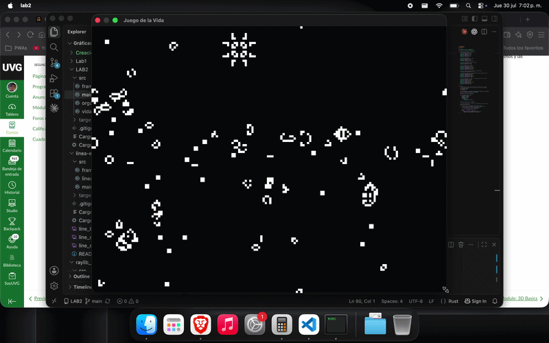

# Lab 2 - Conway's Game of Life

Implementación del juego de la vida de Conway sobre un framebuffer propio, usando únicamente `point` (para pintar) y `get_color` (para leer el estado de una célula).

## Organismos del patrón inicial

**Still lifes**
- Bloque
- Colmena
- Hogaza
- Bote
- Tina

**Osciladores**
- Parpadeador (blinker)
- Sapo (toad)
- Faro (beacon)
- Pulsar

**Naves**
- Planeador (glider)
- Nave ligera (LWSS)

**Cañón**
- Cañón Gosper (Gosper glider gun) — dispara un planeador nuevo cada 30 generaciones

**Methuselahs**
- R-pentomino
- Bellota (acorn)
- Diehard
